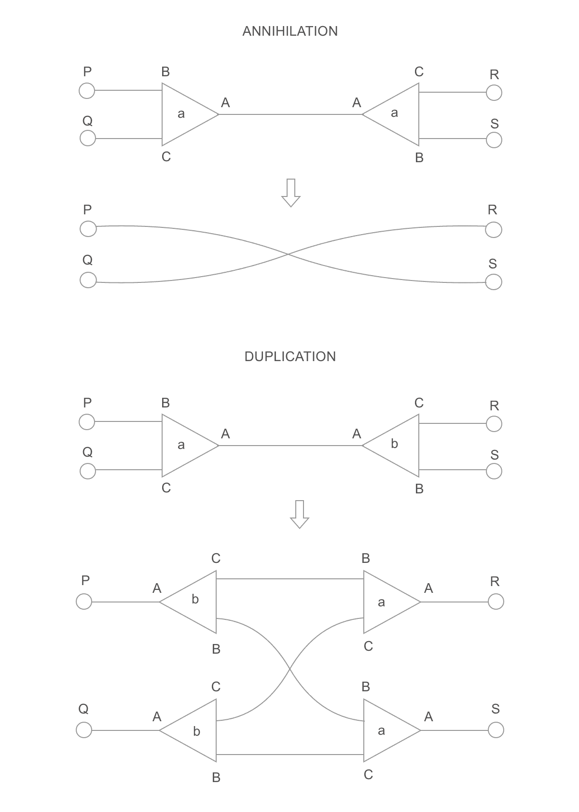
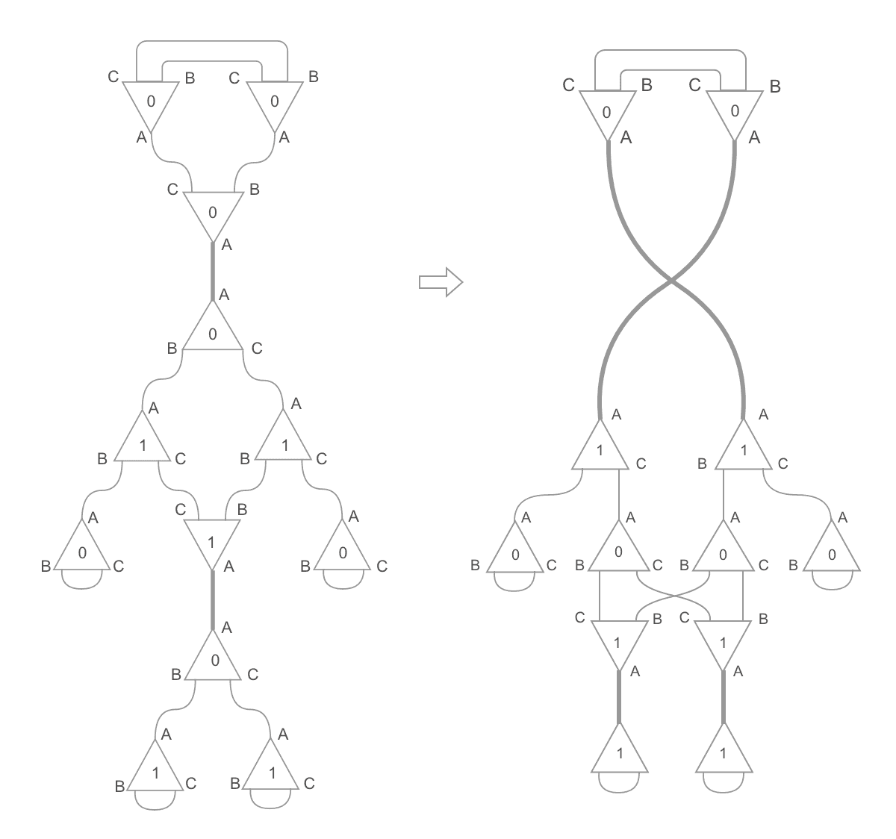
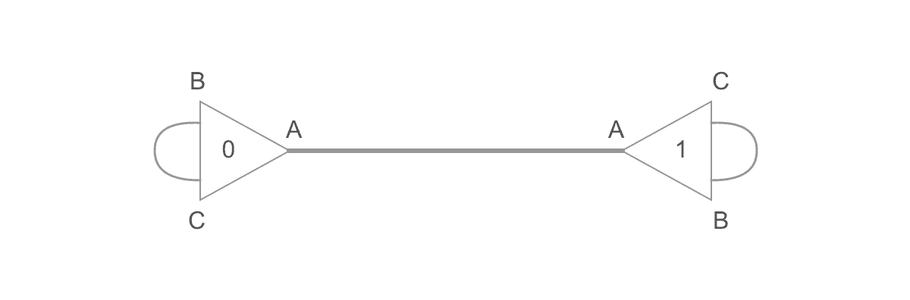
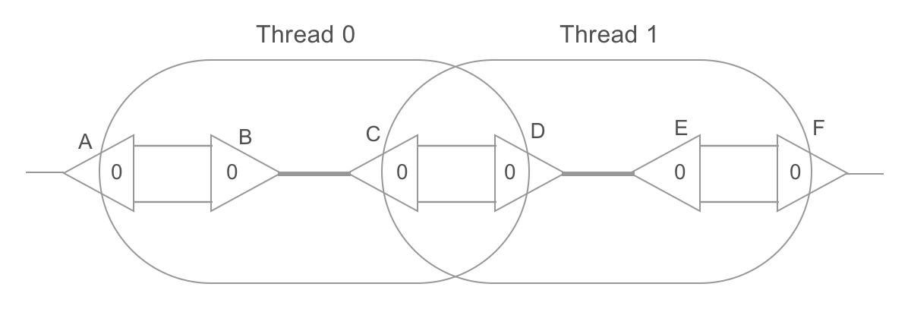
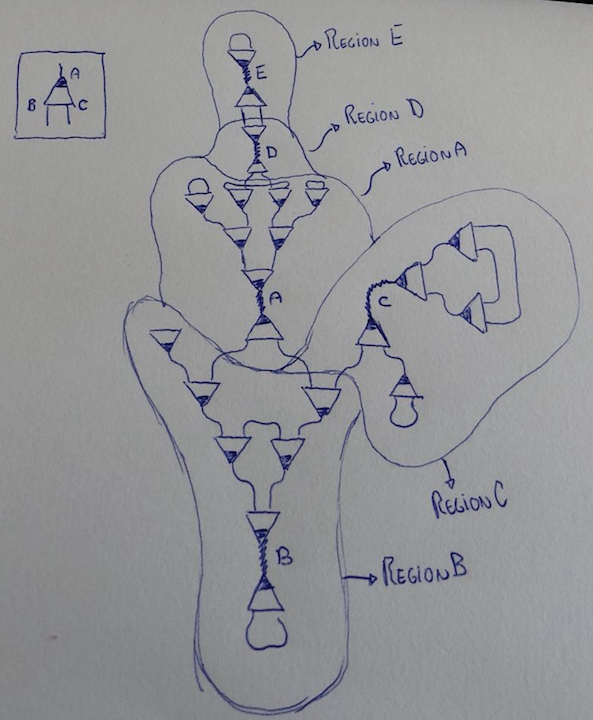

## Lamping's Abstract Algorithm

Absal is a cleaned up adaptation of [Lamping's Abstract Algorithm](http://dl.acm.org/citation.cfm?id=96711). It evaluates functions optimally by encoding a λ-term as ([symmetric](https://scholar.google.com.br/scholar?q=symmetric+interaction+combinators&hl=en&as_sdt=0&as_vis=1&oi=scholart&sa=X&ved=0ahUKEwjNgZbO7aTVAhUEkZAKHYyTAFgQgQMIJjAA)) [interaction combinators](http://www.sciencedirect.com/science/article/pii/S0890540197926432), normalizing the resulting graph, and decoding it back. It asymptotically beats all usual evaluators of functional programs, including Haskell's GHC, Scheme compilers, Google's V8 and so on. Moreover, it is capable of automatically exploiting any inherent parallelizability of your program, since interaction nets are a naturally concurrent model of computation.

EDIT: see https://twitter.com/VictorTaelin/status/1700157621435560203 for an up-to-date solution

## Problem description

The input is a graph where every node has exactly 3 edges coming out of 3 labeled ports (port A, port B, port C) and a single 32-bit "node label" (do not confuse with port labels). If this graph has any edge connecting two nodes through ports A, then those nodes form an "active pair", and must be rewritten following to one of the two following rules:



Here, the triangles represent nodes, `A`, `B` and `C` represent port labels (i.e., their order), `a` and `b` represent node labels (32-bit values), and the lone circles represent separate ports (i.e., some ports in other nodes of the graph). The annihilation rule is used if the node labels are identical. The duplication rule, if they are different. Both rules can make other nodes form active pairs. If that is the case, those must be rewritten too. That process goes on until there is no active pair left.

## Example



The graph to the left is the input. Notice there are two nodes connected through ports of label A: those are active pairs. The graph to the right is the next step of the computation: both of those pairs were rewritten. The pair in the bottom, using the duplication rule, and the pair in the top, using the annihilation rule. Now there are 4 active pairs.

## Parallel implementation

The problem is remarkably parallel, because, at any time, thousands of active pairs can be rewritten independently. The naive algorithm, thus, is simple. First, the graph is represented as a buffer of 32-bit unsigned integers. That buffer is split into quadruples. Each quadruple represents a node. The first 3 slots of the quadruple are the node ports (port A, port B, port C), and their values are the index of the port to which they are linked. The last value of the node is its 32-bit label. So, for example, the following graph:



Is represented as:

```javascript
//            node_A                          node_B
//            port_A  port_B  port_C   label  port_A  port_B  port_C    label   
var buffer = [     4,      2,      1,      0,       0,      6,      5,      1]
//               i=0     i=1     i=2     i=3      i=4     i=5     i=6     i=7
```

The graph has 2 nodes, so the buffer has 4 * 2 = 8 uints. Index 0 of the buffer represents port A of node A. Thus, `buffer[0] = 4`, because 4 is the index of port A of node B. Similarly, `buffer[1] = 2` and `buffer[2] = 1`, because the port B and the port C of node A are connected.

However, there is an exception to the rules in this example. The first node is considered the "root" node; it is never reduced (so, that pair is exceptionally not an active pair).

The algorithm just continuously rewrites active pairs on the buffer as follows:

1. Find the initial list of active pairs;

2. Rewrite them in parallel;

3. Visit neighbor of rewritten nodes, looking for more active pairs;

4. If any is found, go to 2.

There is one problem, though. Notice the following graph:



Here, two threads are trying to rewrite two active pairs, `B-C` and `D-E`, in parallel. The problem is that thread 0 attempts to rewrite a port of the node D, which is currently being read by the thread 1! Or, in other words, while the rewrite rules are local, they can intersect. The following scenario can happen:

1. Thread 0 loads nodes B, C

2. Thread 1 loads nodes D, E

3. Thread 0 rewrites nodes B, C (which also affects A, D)

4. Now, D points to A, not C

5. But kernel 2 loaded the old version of D

6. Thread 1 rewrites D, E with the information it has

7. A now points to node D, which was erased

8. F now points to node C, which was erased

9. Invalid state

To solve that problem, the reduction is performed in two steps.

### First step: redex()

The first step, `redex()`, applies these updated rewrite rules:


They are similar to the rules presented before, but now they are actually local because ports on the neighborhoods of active pairs (i.e., P, Q, R and S) aren't affected. Instead, they keep pointing to the same location, which in turn points to where they should point. Consequently, rewritten nodes can't be erased yet: instead, they are kept on memory as temporary "redirection nodes".

### Second step: visit()

The second step, `visit()`, takes place after the first one (i.e., a global synchronization). It spawns one thread for each neighbor port of the active pair (thus, 4 threads for each `redex()` thread). Each one travels through the graph until it finds a port in a non-redirection node. Then, it rewrites its starting port to point to its final port. It also marks the redirection nodes it visits for garbage collection (that just means that space is free and can be allocated by a duplication rule). Finally, if starting and ending ports have an `A` label, it activates the step 1 again for that active pair.

### Example


Notice that, on the first step, `redex()`, two threads rewrite nodes `B-C` and `D-E` locally. Their effect areas don't intersect, so the thread rewriting `B-C` won't touch `D-E`, and nodes `A` and `F` aren't affected at all. Nodes `B`, `C`, `D` and `E` become redirection nodes. The second step, `visit()`, is, then, responsible for completing the rewrite, freeing redirection nodes and starting step 1 again if new active pairs are found. Since `redex()` had two threads, `visit()` will need 8 threads, starting from ports `Ab, Ac, Db, Dc, Cb, Cc, Fb, Fc` (here, `Ab` represents port `B` of node `A`). As an example, the thread starting from `Ab` walks through this path: `Ab -> Bc -> Db -> Fc`. When it arrives at `Fc` (a non-redirection node), it connects `Ab` to it. It also frees nodes `B` and `D`. Finally, since `Ab <-> Fc` isn't an active pair, it stops. If it was `Aa <-> Fa` instead, it would start a `redex()` thread for it.

This algorithm is implemented on [branch `parallel_test_3` of the `absal-rs` repository](https://github.com/moon-project/absal-rs/tree/parallel-test-3). The OpenCl code is on `main.rs`. Despite still inefficiently implemented, the algorithm managed to achieve about 16m rewrites/s on Intel Iris Graphics 550, exactly the same performance achieved on the sequential Rust implementation in a 3.3 GHZ Intel Core i7.

## Testing

The purpose of this algorithm is to reduce lambda calculus terms optimally. It can, thus, be seen as the runtime of a programming language. It can be tested by converting lambda-terms to buffers on the format described above, reducing it with the implementation, and then translating those buffers back to lambda-terms. If the output corresponds to the normal form of the lambda-term, then the test passes. There are, thus, literally infinite programs with infinitely different characteristics which can be used to test it.

For those wanting to contribute to the project, the Main.rs file on the `parallel-test-3` branch of absal-rs is probably good start. The GENERIC_CODE constant is a λ-program which is generic enough to test the performance for varying sizes. It produces an input buffer which completes in about 500 kernel invocations, and peaks at about ~50k parallel redexes (active pairs). That number can be tweaked by changing the amount of `/f`s on the code. For example:

```
b"@A #f #x /f x @B #f #x /f /f x //#a #b //#c #d ///c #e #f #g //g /e /#h #i #j #k /i ///h i j k f /e /#h #i #j #k /j ///h i j k f d #e #f #g g a //#c #d /c /c /c d b #c ///c #d #e #f #g /e ///d e f g #d #e #f #g /f ///d e f g #d #e #f f A B";
```

This produces a very lightweight input graph that can be reduced fairly quickly. This one is harder:

```
b"@A #f #x /f /f /f /f /f /f x @B #f #x /f /f /f /f x //#a #b //#c #d ///c #e #f #g //g /e /#h #i #j #k /i ///h i j k f /e /#h #i #j #k /j ///h i j k f d #e #f #g g a //#c #d /c /c /c d b #c ///c #d #e #f #g /e ///d e f g #d #e #f #g /f ///d e f g #d #e #f f A B";
```

This one is probably impossible in any existing computer:

```
b"@A #f #x /f /f /f /f /f /f /f /f /f /f /f /f /f /f /f /f /f /f /f /f x @B #f #x /f /f /f /f /f /f /f /f /f /f /f /f /f /f /f /f /f /f /f /f x //#a #b //#c #d ///c #e #f #g //g /e /#h #i #j #k /i ///h i j k f /e /#h #i #j #k /j ///h i j k f d #e #f #g g a //#c #d /c /c /c d b #c ///c #d #e #f #g /e ///d e f g #d #e #f #g /f ///d e f g #d #e #f f A B";
```

And so on. The first sequence of `/f`s determines how parallel-hard that graph is, and the second one determines how sequential-hard it is. Those wanting to implement lambda code independently, may want to add a `println!("{:?}", net)`  after line `let mut net = term::to_net(&term::from_string(code));`. This will print a nice input buffer to test a new implementation. It is also possible to set `net.nodes = your_output_buffer;` (like on line 284) and then use `println!("{}", term::from_net(&net))` to print the corresponding λ-term.

---

### Update: optimization idea

Here is possible way to optimize by enabling local caching:



1. On CPU, get the initial list of N active edges. On the example above, there are 5 active edges.

2. The graph is logically split in N regions, where each region contains the nodes that have their A-ports pointing to that active edge. (This is not a computing step, just an imaginary separation.)

3. For each region, pre-load it on the local cache of the same GPU chip. To do it, just load the active ports (i.e., `A_port`, `B_port`), then the corresponding nodes (i.e., `A = nodes_buf_vec[node(A_port)]`, `B = nodes_buf_vec[node(B_port)]`), then load its neighbor ports (i.e., `C_port = nodes_buf[port(A,1)]`, `D_port = nodes_buf[port(A,2)]`, `E_port = nodes_buf[port(B,1)]`, `F_port = nodes_buf[port(B,2)]`), then the corresponding nodes, then the neighbors of the neighbors and so on. We stop loading when `slot(neighbor_port) != 0`, because that means that neighbor does not point to the active edge of this region.

4. Reduce regions in parallel, doing as much as possible locally, alternating locally-synchronized `redex()/visit()` calls, until there are no more local active edges. At this point, all `A` ports point to either `B`/`C` ports, or the region boundaries. We write back to global memory, performing adequate pointer-space translations.

5. Start a global `visit()` kernel for each of those `A` port pointing to boundaries. This will make appropriate connections, and generate a new list of active edges.

6. Go to 3.

The point is the observation that those regions can be reduced in isolation. So, for example, on this graph, RegionB would need 5 rewrites to complete (and much more if some of those nodes have different labels). All those could be performed locally without ever reaching the global memory.

Only problem is, of course, sometimes regions can be larger than the local cache of the core. In that case you could do it in chunks, I guess. Or they could be much smaller, so it would be good if the same core could process N small regions. 

Further notes: of course, there is the added cost of pre-loading nodes that aren't active. But all those nodes WILL be active in a future anyway (because they point to an active edge)! So, there will be no more loads in total. Also, note we would not pre-load the region around the root "active edge" (the one with index zero) because that one is not active. As the reduction proceeds, that region will grow and eventually the whole graph will be on it (when there are no more active edges).

More notes: observe the load can be performed in parallel. First, load the two nodes around the active edges. Then, the up-to-4 neighbor nodes of those 2. Then, the up-to-8 neighbor nodes of those 4. This works because each region can be seen as two binary trees starting from the active edge and ending on the region boundaries. Also, note that local nodes could use 16-bit pointers (and labels), so a node would have 64 bits, and, thus, 4000 nodes could fit a 32kb cache; which, in turn, means we could perform as much as 4000 rewrites with only local cache reads and synchronizations before having to write to global memory. Of course, we'd need to keep track of boundary pointers, to be able to translate from local space to global space again.

The trickiest problem, to me, seems to be how to deal with too small regions (i.e., it'd be a waste to occupy an entire core with a region with only 2 nodes), and too large regions (that won't fit a single core). Edit: actually, for large regions, it could be as simple as "just load as much as possible and ignore the rest". When it is done reducing that, it will call visit() kernels to link boundaries anyway, so the parts that didn't fit will now be parts of other regions. (In fact, the currently implemented algorithm could be seen as a special case of this one, where each region has at most 2 nodes.) For small regions, just allow a core to load more regions up to until its local cache is full.
