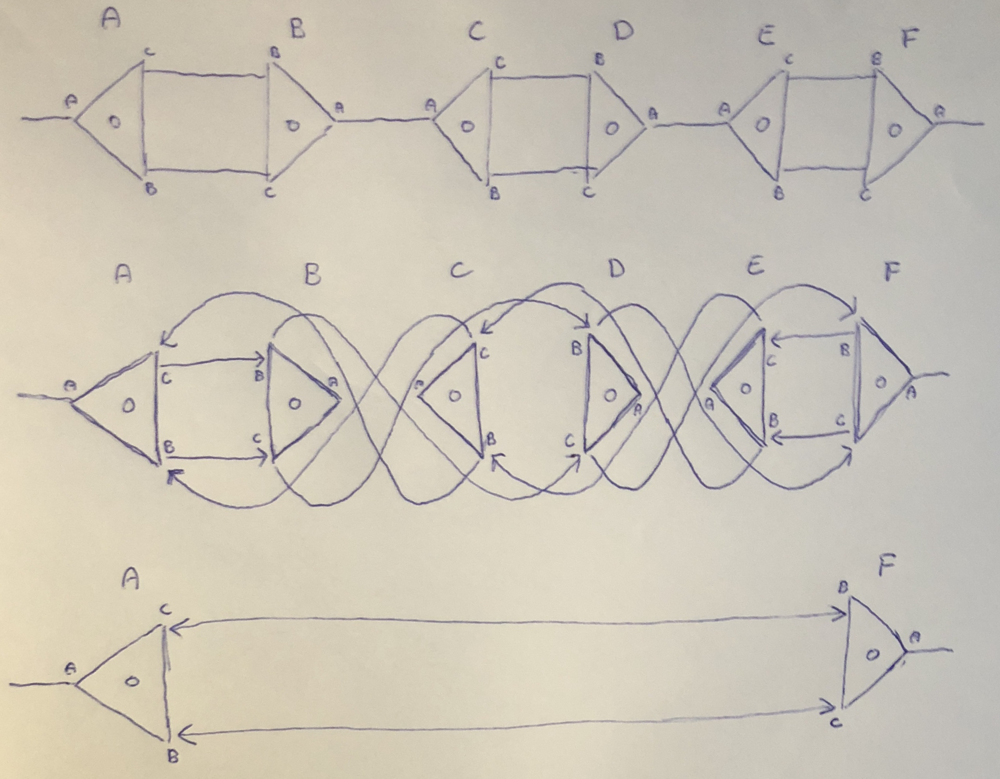

Note: just a draft, will be reviewed soon

## Problem description

The input is a graph where every node has exactly 3 edges coming out of 3 labelled ports (port A, port B, port C) and a single 32-bit "node label" (do not confuse with port labels). If this graph has any edge connecting two nodes through ports A, then those nodes form an "active pair", and must be rewritten due to one of the two following rules:


Here, the triangles represent nodes, `A`, `B` and `C` represent port labels (i.e., their order), `a` and `b` represent node labels (32-bit values), and the lone circles represent separete ports (i.e., some ports in other nodes of the graph). The first rule is used if the node labels are identical. The second one if they are different. That could cause different nodes to become active pairs. If that is the case, those must be rewritten too. That process goes on until there is no active pair left. 

## Example


The graph to the left is the input. Notice there are two nodes connected through ports of label A: those are active pairs. The graph to the right is the next step of the computation: both of those nodes were rewritten, the bottom ones using the second rule, and top ones using the first rule. Now there are 4 active pairs.

## Parallel implementation

That problem is remarkably parallel, because, at any point in time, thousands of active pairs can be rewritten independently. The naive algorithm, thus, is simple. First, the graph is represented as a buffer of 32-bit unsigned integers. That buffer is split into quadruples. Each quadruple represent a node. The first 3 slots of the quadruple are the node ports (port A, port B, port C), and their values are the index of the adjacent port. The last value of the node is its 32-bit label. So, for example, the following graph:


Is represented as:

```javascript
//            node_A                          node_B 
//            port_A  port_B  port_C   label  port_A  port_B  port_C    label   
var buffer = [     4,      2,      1,      0,       0,      6,      5,      1]
//               i=0     i=1     i=2     i=3      i=4     i=5     i=6     i=7
```

The graph has 2 nodes, so the buffer has 4 * 2 = 8 uints. The index 0 of the buffer represents the port A of the node A. Thus, `buffer[0] = 4`, because 4 is the position of the port A of node B. Similarly, `buffer[1] = 2` and `buffer[2] = 1`, because the port B and the port C of the node A are connected. Also, the first node is considered the "root" node; it is never reduced (so, that pair is exceptionally not an active pair). The algorithm them just continuously rewrittes active pairs on that buffer as such:

1. Find the initial list of active pairs;

2. Rewrite them in parallel;

3. Visit neighbor of rewritten nodes, looking for more active pairs;

4. If any is found, go to 2.

There is one problem, though. Notice the following graph:


Here, two threads are trying to rewrite two active pairs, `B-C` and `D-E`, in parallel. The problem is that thread 0 attempts to rewrite a port of the node D, which is currently being read by the thread 1! Or, in other words, while the rewrite rules are local, they can intersect. The following scenario can happen:

1. Thread 0 loads nodes B, C

2. Thread 1 loads nodes D, E

3. Thread 0 rewrites nodes B, C (which also affects A, D)

4. Now, D points to A, not C

5. But kernel 2 loaded the old version of D

6. Thread 1 rewrites D, E with the information it has

7. A now points to node D, which was erased

8. F now points to node C, which was erased

9. Invalid state

To solve that problem, I perform the reduction in two steps. 

### First step: redex()

The first step, `redex()`, applies those updated rewrite rules:


They're similar to the ones I drawn before, but now they're actually local because ports on the neighborhoods of active pairs (i.e., P, Q, R and S) aren't affected. Instead, they keep pointing to the same location, but that location now points to where they should point. Consequently, rewritten nodes can't be erased yet: instead, they are kept on memory as temporary "redirection nodes". 

### Second step: visit()

The second step, `visit()`, takes place after the first one (i.e., a global synchronization). It spawns one thread for each neighbor port of the active pair (thus, 4 threads for each `redex()` thread). Each one travels through the graph until it finds a port in a non-redirection node. Then, it rewrites its starting port to point to its final port. It also marks the redirection nodes it visits for garbage collection (that just means that space is free and can be allocated by a duplication rule). Finally, if starting and ending ports have an `A` label, it activates the step 1 again for that active pair. Here is an example:



Notice that, on the first step, `redex()`, two threads rewrite nodes `B-C` and `D-E` locally. Their effect areas don't intersect, so the thread rewritting `B-C` won't touch `D-E`, and nodes `A` and `F` aren't affected at all. Nodes `B`, `C`, `D` and `E` become redirection nodes. The second step, `visit()`, is, then, responsible for completing the rewrite, freeing redirection nodes and starting step 1 again if new active pairs are found. Since `redex()` had two threads, `visit()` will need 8 threads, starting from ports `Ab, Ac, Db, Dc, Cb, Cc, Fb, Fc` (here, `Ab` represents port `B` of node `A`). As an example, the thread starting from `Ab` walks through this path: `Ab -> Bc -> Db -> Fc`. When it arrives at `Fc` (a non-redirection node), it connects `Ab` to it. It also frees nodes `B` and `D`. Finally, since `Ab <-> Fc` isn't an active pair, it stops. If it was `Aa <-> Fa` instead, it would start a `redex()` thread for it.

This algorithm is implemented on the [branch `parallel_test_3` of the absal-rs repository](https://github.com/moon-project/absal-rs/tree/parallel-test-3). The OpenCl code is on `main.rs`. Despite being a GPU newbie and probably doing a lot of innefficient things (like using `atomic_inc()` to implement global stacks, and reading data from the GPU between each kernel call), I managed to achive about 16m rewrites/s on Intel Iris Graphics 550, exactly the same performance I got on my sequential Rust implementation in a 3.3 GHZ Intel Core i7. My hope is that an expert in GPUs would be able to improve that number considerably.

Note that I just came up with this myself, you probably know simpler and smarter solutions for this issue.

## Testing

The purpose of this algorithm is to reduce lambda calculus terms optimally. It can, thus, be seen as the runtime of a programming language. It can be tested by converting lambda-terms to buffers on the format I described above, reducing it with the implementation, and then translating those buffers back to lambda-terms. If the output corresponds to the normal form of the lambda-term, then the test passes. There are, thus, literally infinite programs with infinitely different characteristics you could use to test it. I have Rust and JavaScript code capable of doing that, and will set up a bench of tests in the case we move forward. 

In order for you to work, the Main.rs file on the `parallel-test-3` branch of absal-rs is probably good start. The string on line 197 is a λ-program which is generic enough to test the performance for varying sizes. It produces an input buffer which completes in about 500 kernel invocations, and peaks at about ~50k parallel redexes (active pairs). That number can be tweaked by changing the amount of `/f`s on the code. For example:

```
b"@A #f #x /f x @B #f #x /f /f x //#a #b //#c #d ///c #e #f #g //g /e /#h #i #j #k /i ///h i j k f /e /#h #i #j #k /j ///h i j k f d #e #f #g g a //#c #d /c /c /c d b #c ///c #d #e #f #g /e ///d e f g #d #e #f #g /f ///d e f g #d #e #f f A B";
```

This produces a very lightweight input graph that can be reduced fairly quickly. This one is harder:

```
b"@A #f #x /f /f /f /f /f /f x @B #f #x /f /f /f /f x //#a #b //#c #d ///c #e #f #g //g /e /#h #i #j #k /i ///h i j k f /e /#h #i #j #k /j ///h i j k f d #e #f #g g a //#c #d /c /c /c d b #c ///c #d #e #f #g /e ///d e f g #d #e #f #g /f ///d e f g #d #e #f f A B";
```

This one is probably impossible in any existing computer:

```
b"@A #f #x /f /f /f /f /f /f /f /f /f /f /f /f /f /f /f /f /f /f /f /f x @B #f #x /f /f /f /f /f /f /f /f /f /f /f /f /f /f /f /f /f /f /f /f x //#a #b //#c #d ///c #e #f #g //g /e /#h #i #j #k /i ///h i j k f /e /#h #i #j #k /j ///h i j k f d #e #f #g g a //#c #d /c /c /c d b #c ///c #d #e #f #g /e ///d e f g #d #e #f #g /f ///d e f g #d #e #f f A B";
```

And so on. The first sequence of `/f`s determines how parallel-hard that graph is, and the second one determines how sequential-hard it is. If you want to implement your code independently, you may want to add a `println!("{:?}", net)`  after line 198. That way, you'll get a nice input buffer to test your implementation. You can also set `net.nodes = your_output_buffer;` (like on line 284) and then use `println!("{}", term::from_net(&net))` to print the corresponding λ-term. If it matches with the output of my implementation, then it is correct. You can also do it on the `master` branch if you just want input/output buffers and terms, in the case my OpenCL code doesn't run there. There is also a JavaScript implementation if Rust isn't your thing. And, of course, you can ignore my code and build some random graphs yourself and implement/test it in whatever way you feel like.


